## Use modified penetration depth and guided search to solve nesting problem 

Author: Yang Shan, Wang Zilu 

From: Department of Management Science and Engineering, Tongji University

We modify penetration depth to make searching new positions for polygons in the global scale feasible with computing complexity reduced. The report using English will be updated soon.

## Report(Chinese)

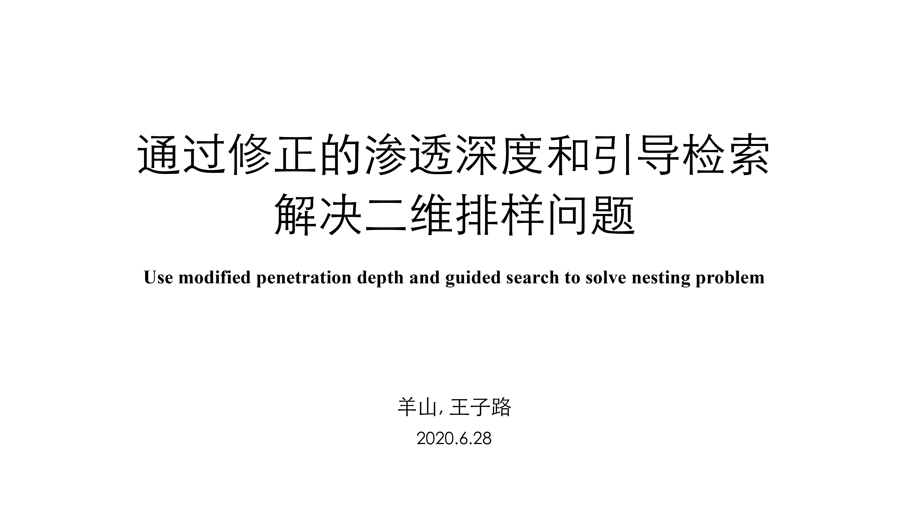

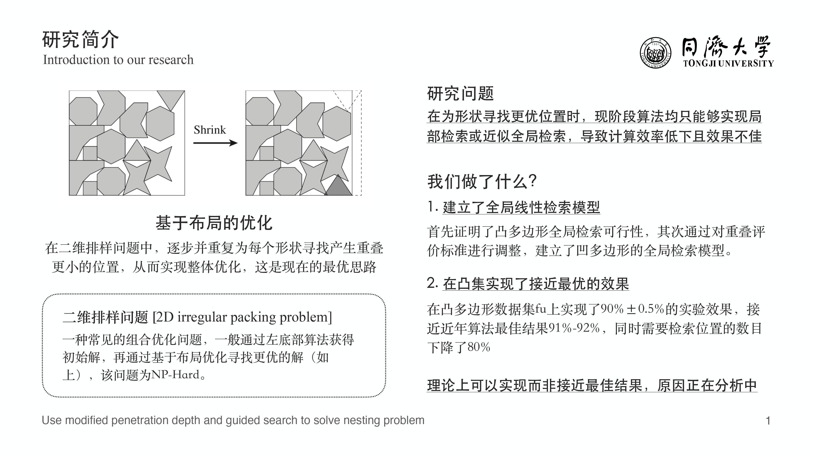

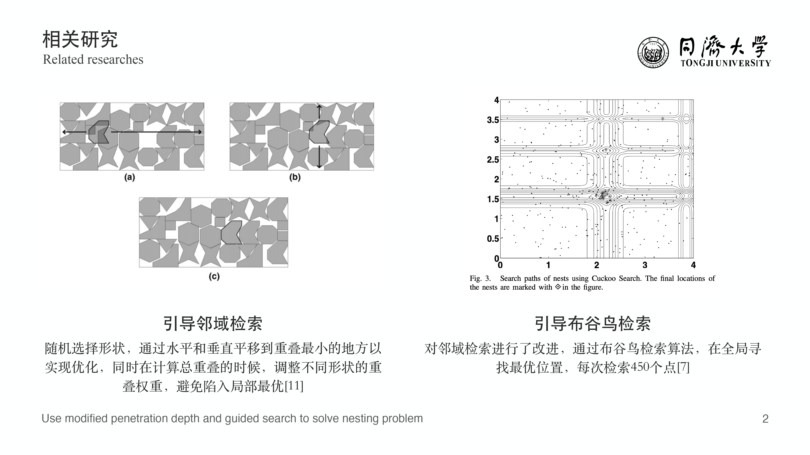

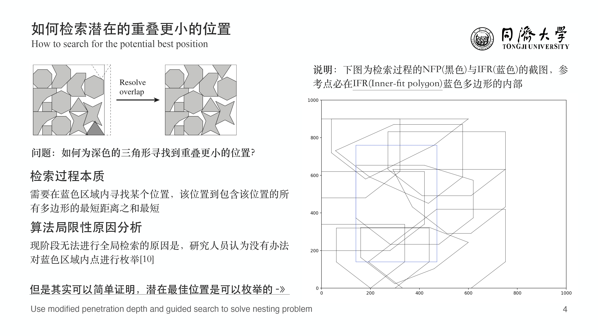

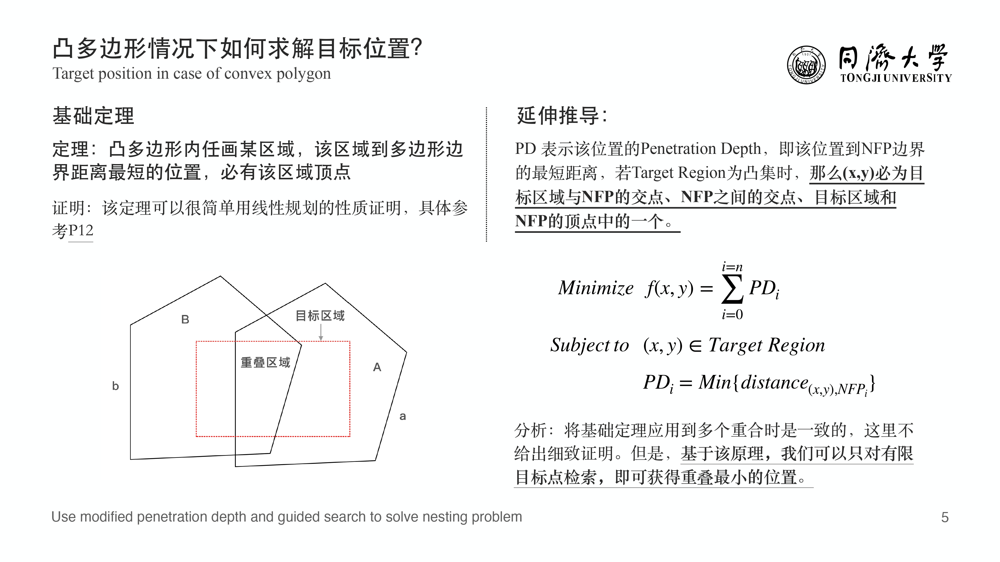

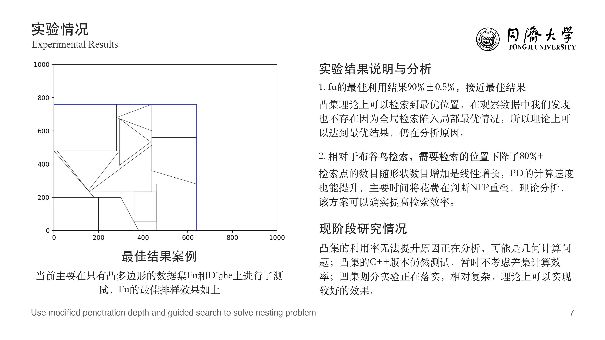

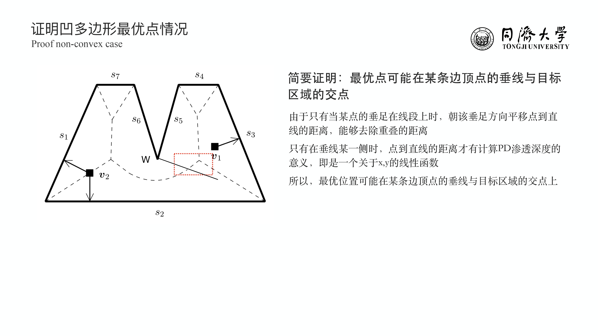

## Introduction

2D Nesting problem is a kind of combination optimization problem which tragets at maximizing the utilization ratio by arranging the layout of all shapes. 

It is a NP-Hard problem and to achieve global optimization is almost impossible. As a result, the most common way to optimize the layout is searching a new better position for polygons step by step.

Guided cuckoo search proposed by Elkeran is the methodology that can obtain the best result by now. This approache applied a elvolution algorithm named cuckoo search to settle searching a new position on a two-dimensional plane. 

However, the searching efficiency is low because the best position can't 

**For the cuckoo search, it needs to search over 450 positions and the best position may not be found. However, take dateset fu for example, after about only 50-70 positions be tested, the location with the least penetration depth can be found.**

## What we have done？ 

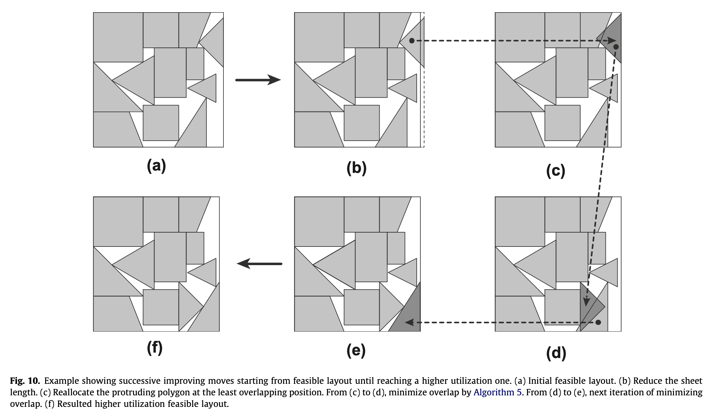

## Algorithm Outline

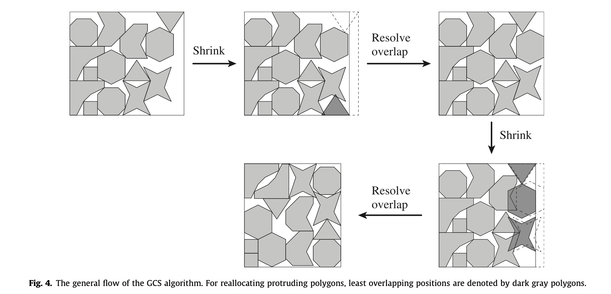

## Geometry

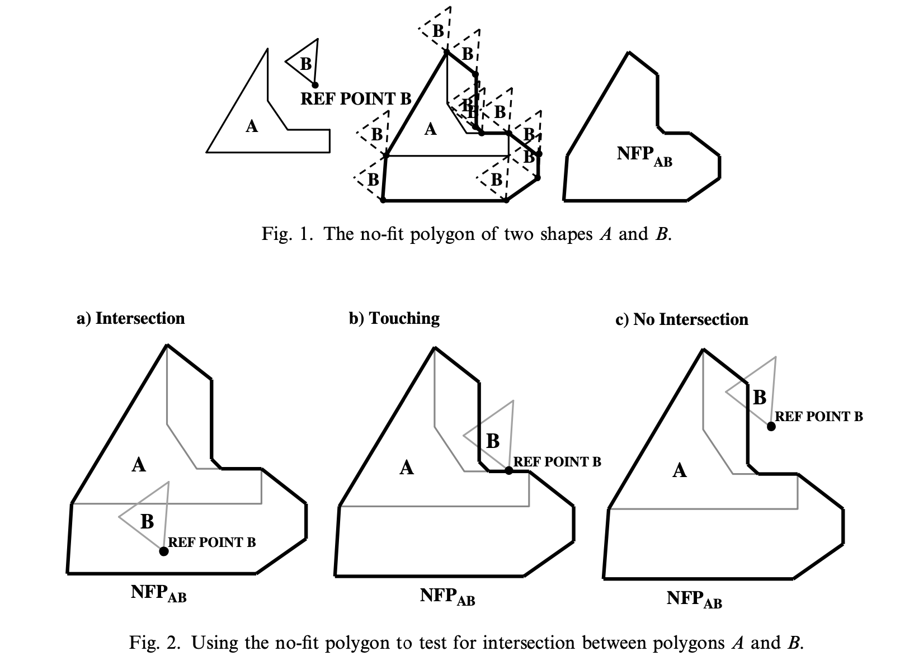

### Convex

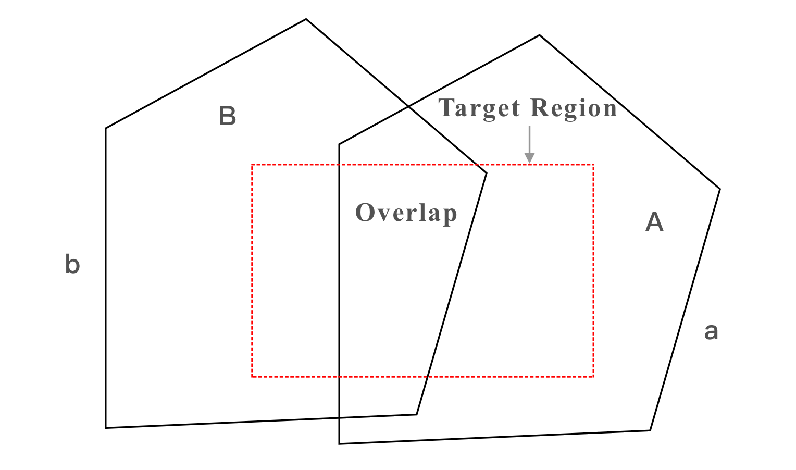

### Non-Convex

## Experiments

