## Use modified penetration depth and guided search to solve nesting problem 

Author: Yang Shan(羊山), Wang Zilu(王子路) 

From: Department of Management Science and Engineering, Tongji University

**Paper for this work is still editing and the experiment is still in progress.** 

We modify penetration depth and realized precisely global search the first time on nesting problem. Hybridize it with guided search, we named it GLPS. 

This methodology has obtained pronounced results compared with benchmarks.

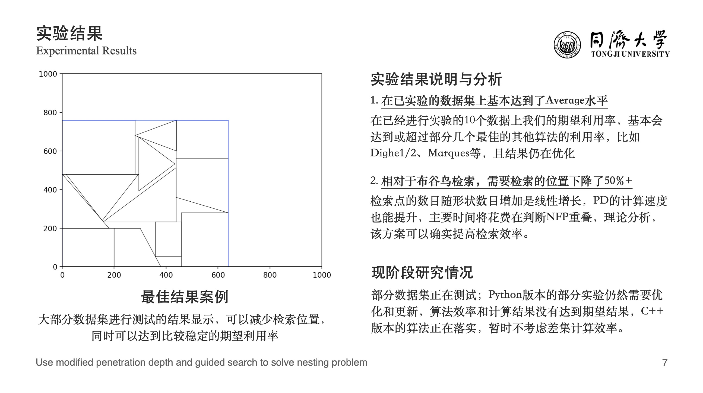

## Report(Chinese)

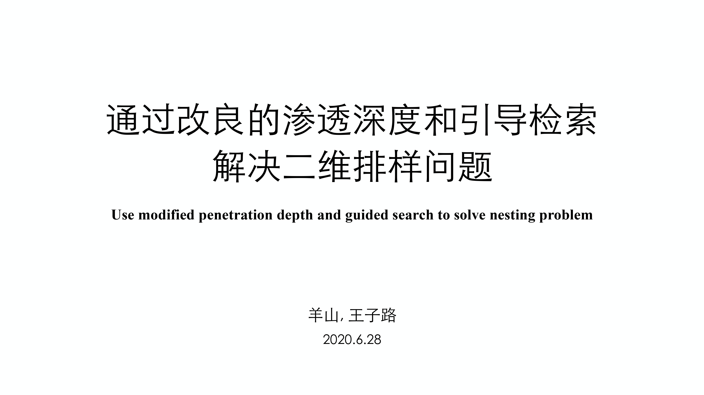

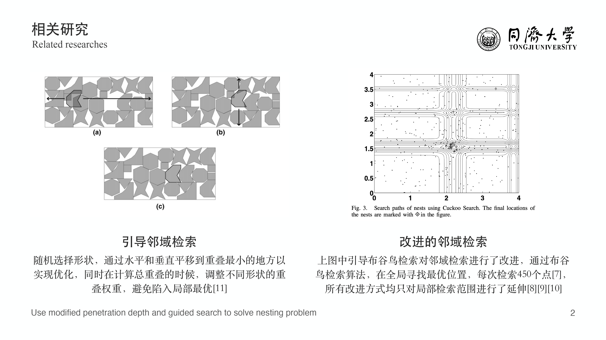

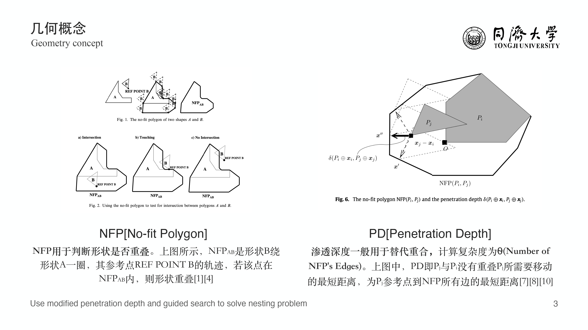

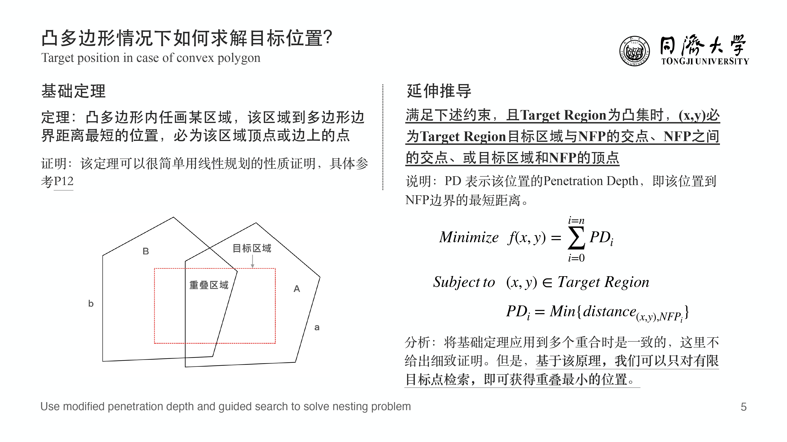

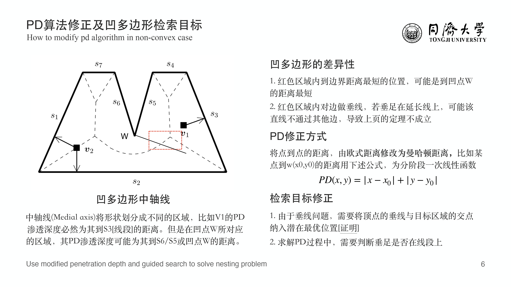

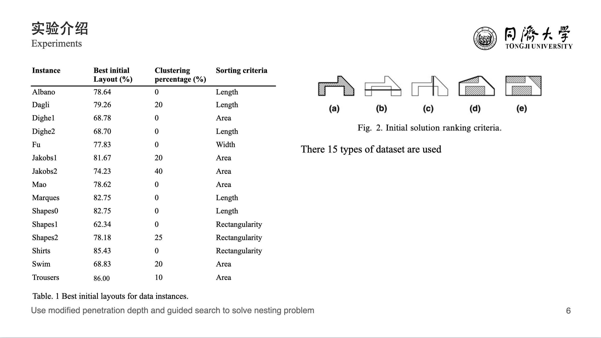

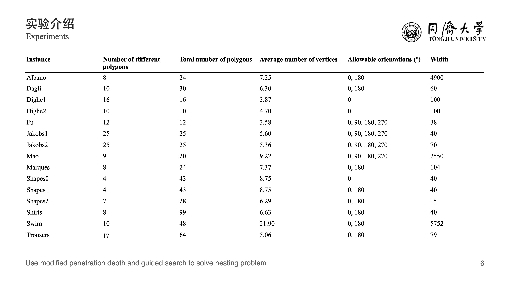

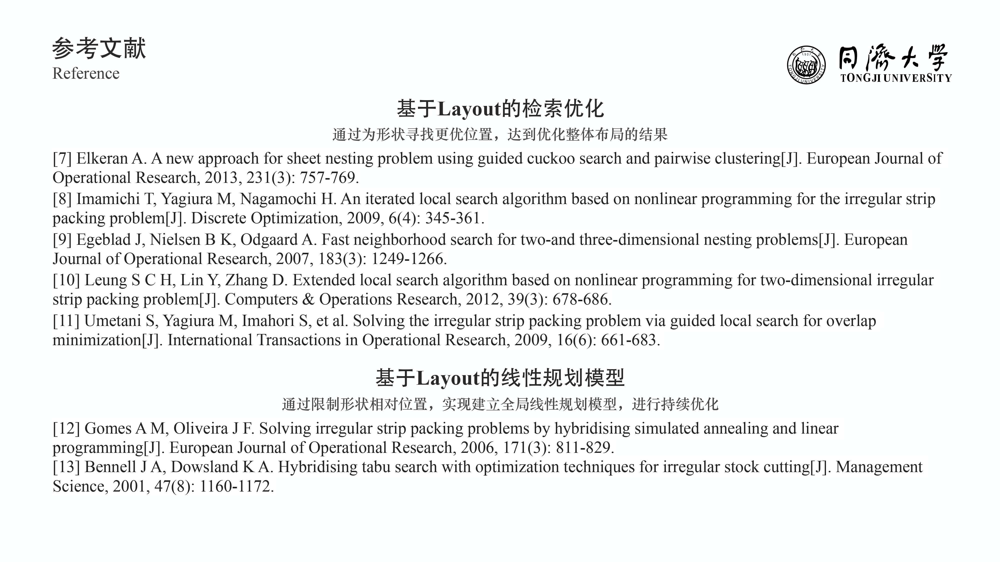

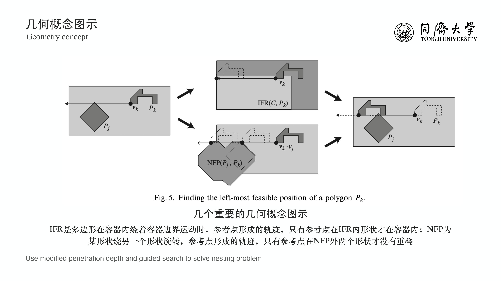

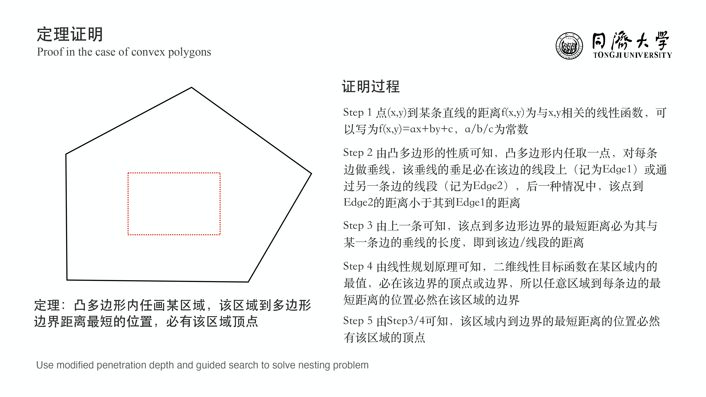

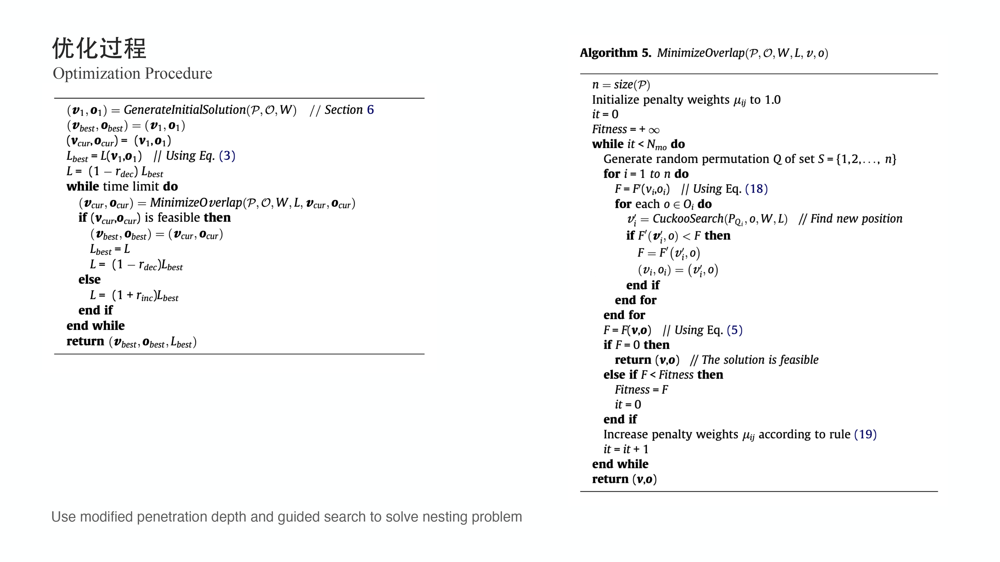

## Introduction

2D Nesting problem is a kind of combination optimization problem which tragets at maximizing the utilization ratio by arranging the layout of all shapes. 

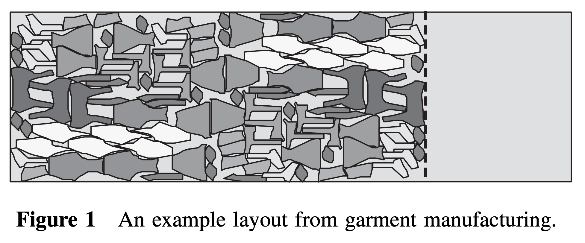

It is a NP-Hard problem and to achieve global optimization is almost impossible. As a result, the most common way to optimize the layout is searching a new better position for polygons step by step.

Guided cuckoo search proposed by Elkeran is the methodology that can obtain the best result by now. This approache applied a elvolution algorithm named cuckoo search to settle searching a new position on a two-dimensional plane. 

However, the searching efficiency is low because the best position can't 

**For the cuckoo search, it needs to search over 450 positions and the best position may not be found. However, take dateset fu for example, after about only 50-70 positions be tested, the location with the least penetration depth can be found.**

